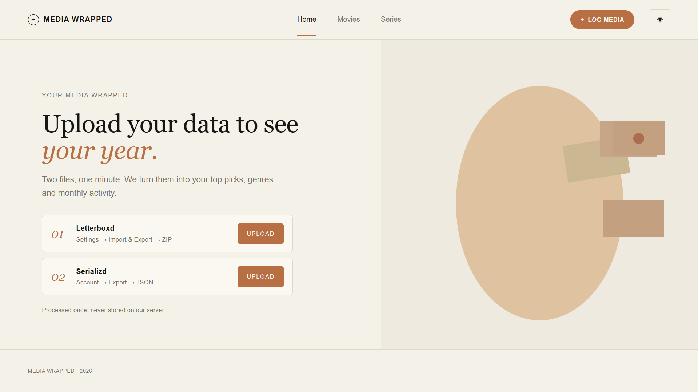
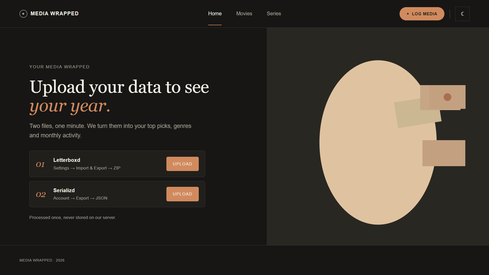

# Media Wrapped

A "Spotify Wrapped" style page for movies and series. You upload your Letterboxd and Serializd exports, and it turns them into a yearly summary: your top picks, favorite genres, hours watched, and a month-by-month activity chart.

I built it because I log everything I watch, and I wanted to see the whole year in one place instead of scrolling through two different apps.




## What it does

- **Imports your real data.** Upload your Letterboxd ZIP export and your Serializd JSON export.
- **Home, Movies and Series pages.** Home combines both. Movies and Series each get their own stats.
- **Top picks with posters.** Your highest-rated titles, with posters pulled from TMDB.
- **Genre breakdown and monthly activity.** Series activity counts episodes watched, and you can filter the chart by year.
- **Hours watched.** For series I use the real episode runtimes from TMDB. If TMDB doesn't have a runtime, I estimate it, and the app tells you when that happens.
- **View all.** See every movie or series ranked from highest to lowest rating.
- **Light and dark theme.**
- **No accounts.** The site starts empty for every visitor. Your results are saved in your own browser (localStorage), and there is a "Clear my data" button to remove them.

## Tech stack

**Frontend:** HTML, CSS and vanilla JavaScript, with Chart.js for the charts. No framework.

**Backend:** Python with FastAPI. It reads the uploaded files, then asks the TMDB API for posters, genres and runtimes using `httpx`.

## How it works

1. The browser sends your file to the FastAPI server (`/api/movies/import` for Letterboxd, `/api/series/import` for Serializd).
2. The importer in `backend/importer/` reads the file and cleans it up.
3. The server looks up each title on TMDB and adds posters, genres and runtimes. Lookups are cached in `tmdb_cache.json` so the next import is faster.
4. The server sends back the result, and the frontend builds the stats and charts and saves them in localStorage.

Your files are processed once and are not stored on the server.

## Project structure

```
personal wrapped media/
├── frontend/
│   ├── index.html
│   ├── style.css
│   └── js/
│       ├── data.js        chart colors and default data
│       └── main.js        rendering, imports, navigation
└── backend/
    ├── main.py            FastAPI app and TMDB lookups
    ├── importer/
    │   ├── letterboxd.py  reads the Letterboxd ZIP
    │   └── serializd.py   reads the Serializd JSON
    ├── requirements.txt
    └── .env               
```
## Getting your data

- **Letterboxd:** export your data from your Letterboxd account settings. You get a ZIP file. Upload it as it is, without unzipping. It needs `watched.csv`, `ratings.csv` and `diary.csv` inside.
- **Serializd:** export your data from your Serializd account as a JSON file.

## Credits

This product uses the TMDB API but is not endorsed or certified by TMDB. Posters, genres and runtimes come from [The Movie Database](https://www.themoviedb.org/).

Built by Adadoua Randa.